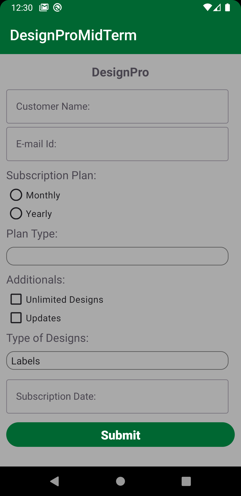
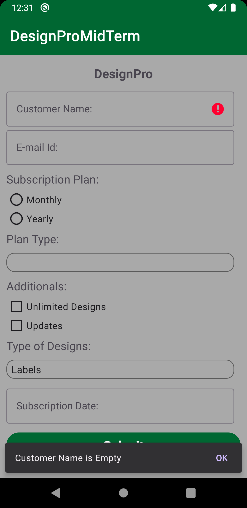
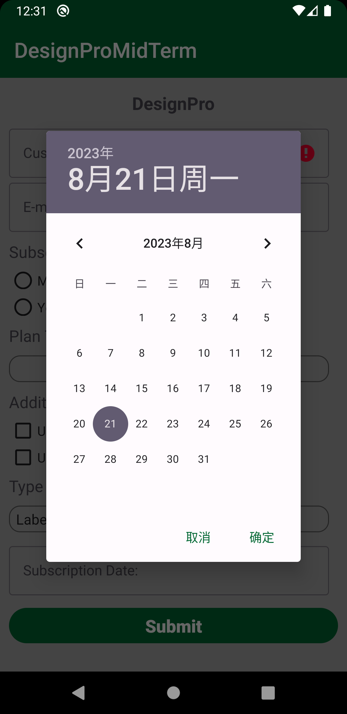
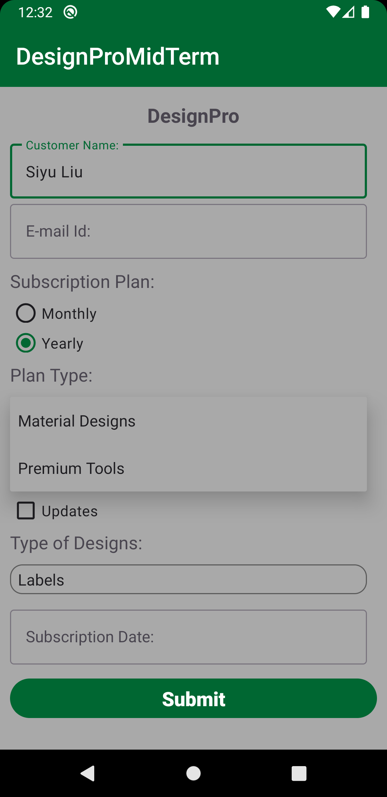

# PROG8485-Android-Midterm-Exam-Design-Pro

The midterm exam project of Conestoga College PROG8485 Mobile Application Development. The project's layout, including the xml files are provided by the professor, while the main work for students is finishing the Java code to meet the demands on eConestoga. This project just should be finished within 3 hours.

## Preview

